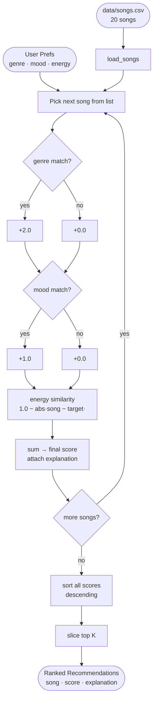

# 🎵 Music Recommender Simulation

## Project Summary

In this project you will build and explain a small music recommender system.

Your goal is to:

- Represent songs and a user "taste profile" as data
- Design a scoring rule that turns that data into recommendations
- Evaluate what your system gets right and wrong
- Reflect on how this mirrors real world AI recommenders

Replace this paragraph with your own summary of what your version does.

---

## How The System Works

Explain your design in plain language.
Real-world recommendation systems like Spotify's Discover Weekly operate as massive hybrid engines — they blend collaborative filtering (learning from millions of users' collective behavior: plays, skips, saves, playlist adds) with content-based filtering (analyzing the actual sonic DNA of songs: energy, tempo, valence, acousticness) and layer contextual signals on top (time of day, device, recent session history). The result is a system that feels almost telepathic because it triangulates who you are as a listener, what the music objectively sounds like, and what moment you're in — all simultaneously. No single signal drives the output; it's the weighted consensus of hundreds of features passed through matrix factorization, neural audio embeddings, and NLP on playlist text. This simulator is intentionally a pure content-based recommender — no user history, no crowd behavior, no context. Given a seed song or preference profile, it will score every candidate in songs.csv using a Gaussian similarity function across four audio features (energy, valence, tempo, danceability), weighted by how strongly each feature drives perceived "vibe." Categorical signals — mood, genre, artist — act as multipliers and penalties rather than hard filters, so a great numeric match is never killed by a genre label mismatch, but a confirmed same-mood match gets a meaningful boost. The ranking layer then excludes the seed, enforces a minimum quality threshold, and
 slices the top results. The deliberate tradeoff: this version sacrifices discovery-by-crowd-wisdom in exchange for being fully explainable — every score is traceable back to a specific feature difference, which makes it a clean learning model for understanding the math before the complexity of collaborative systems is introduced.
Some prompts to answer:

- What features does each `Song` use in your system
  - For example: genre, mood, energy, tempo
  Each Song in recommender.py:5-19 carries ten attributes loaded directly from songs.csv. Three are identity fields (id, title, artist) used only for display. The remaining seven are the features that drive recommendations:
  genre and mood — categorical labels used as bonus/penalty modifiers
  energy — the single most important feature; immediately felt as calm vs. intense
  valence — emotional tone: happy/bright vs. dark/melancholic
  tempo_bpm — governs activity fit (studying, running, sleeping)
  danceability — rhythmic feel; minor refinement on top of energy
  acousticness — organic vs. electronic texture; largely redundant with energy in this dataset

- What information does your `UserProfile` store
The UserProfile in recommender.py:21-30 is a snapshot of current preference — not listening history. It stores:

favorite_genre — used to award a genre-match bonus during scoring
favorite_mood — used for mood-match bonus and opposite-mood penalty
target_energy — the numeric anchor; the recommender rewards songs closest to this value
likes_acoustic — boolean flag that can shift weight toward or away from acousticness
There is no play history, skip log, or crowd data — this is a pure content-based profile.
- How does your `Recommender` compute a score for each song
The recommend method at recommender.py:40-42 (currently a stub) will score each candidate song in three layers:
Layer 1 — Gaussian numeric similarity for each feature (σ = 0.20):
S(x) = exp( -(x_song - x_pref)² / (2 × 0.04) )
This rewards songs close to the user's preference, not songs that are merely high or low. A song 0.05 away scores ~0.97; a song 0.50 away scores ~0.04.
Layer 2 — weighted combination of the four numeric scores:
numeric = 0.40·S(energy) + 0.30·S(valence) + 0.20·S(tempo) + 0.10·S(danceability)
Layer 3 — categorical multiplier and penalty:
× (1.0 + 0.20·mood_match + 0.10·genre_match)
× (1.0 - 0.30·opposite_mood - 0.15·big_tempo_gap)
Final score is capped at [0.0, 1.0]. Every point is traceable back to a specific feature difference.
- How do you choose which songs to recommend
After scoring, the ranking layer in recommend_songs() at recommender.py:57-64 makes five sequential decisions:
1. SCORE    compute final_score for every song in the catalog
2. EXCLUDE  remove the seed song itself (id match — can't recommend what's already playing)
3. FILTER   drop any song scoring below 0.30 (too jarring, not a plausible next track)
4. SORT     order remaining songs by final_score descending
5. SLICE    return the top k (default k=5)
The distinction matters: scoring is per-song (how good is this one candidate?), ranking is over the whole list (given all scores, what do we actually serve?). Keeping them separate means either rule can be tuned independently — change the weights without touching the ranking logic, or change k without touching the scoring math.
You can include a simple diagram or bullet list if helpful.

### Data Flow Diagram



---

### Algorithm Recipe

This is the exact scoring formula used in `recommend_songs()`:

```
score = genre_points + mood_points + energy_similarity
```

| Signal | Rule | Points |
|---|---|---|
| Genre match | +2.0 if `song.genre == user.favorite_genre` | 0 or 2.0 |
| Mood match | +1.0 if `song.mood == user.favorite_mood` | 0 or 1.0 |
| Energy similarity | `1.0 - abs(song.energy - user.target_energy)` | 0.0 – 1.0 |

**Maximum possible score: 4.0**

The genre and mood signals are binary (match or no match). The energy signal is continuous — a song at exactly the user's target energy contributes the full 1.0; a song at the opposite extreme contributes 0.0.

**Example — user: `pop / happy / 0.8`**

| Song | Genre | Mood | Energy score | Total |
|---|---|---|---|---|
| Sunrise City (pop, happy, 0.82) | +2.0 | +1.0 | 0.98 | **3.98** |
| Gym Hero (pop, intense, 0.93) | +2.0 | +0.0 | 0.87 | **2.87** |
| Rooftop Lights (indie pop, happy, 0.76) | +0.0 | +1.0 | 0.96 | **1.96** |
| Midnight Coding (lofi, chill, 0.42) | +0.0 | +0.0 | 0.62 | **0.62** |

---

### Known Biases and Limitations

**Genre dominance.** Genre is worth 2.0 points — double the mood weight. A song in the wrong genre but with a perfect mood and energy match can score at most 2.0, while a same-genre song with a bad mood and poor energy still scores around 2.3. The system will consistently surface genre-loyal songs over cross-genre discoveries, even when those discoveries would feel right to the user.

**Mood is all-or-nothing.** A song labeled `relaxed` gets zero mood points for a user who wants `chill`, even though those moods are adjacent. The binary match misses the spectrum between moods.

**Energy is the only continuous signal.** Valence, danceability, and tempo are completely ignored. A sad-sounding song at the right energy level can score identically to an upbeat one, which may feel wrong in practice.

**Small catalog amplifies all biases.** With only 20 songs, some genres (e.g. lofi, pop) have multiple entries while others (e.g. blues, soul) have one. Users whose favorite genre has few catalog entries will almost always see cross-genre fallbacks in their top 5.


## Getting Started

### Setup

1. Create a virtual environment (optional but recommended):

   ```bash
   python -m venv .venv
   source .venv/bin/activate      # Mac or Linux
   .venv\Scripts\activate         # Windows

2. Install dependencies

```bash
pip install -r requirements.txt
```

3. Run the app:

```bash
python -m src.main
```

### Running Tests

Run the starter tests with:

```bash
pytest
```

You can add more tests in `tests/test_recommender.py`.

---

## Experiments You Tried

Use this section to document the experiments you ran. For example:

- What happened when you changed the weight on genre from 2.0 to 0.5
- What happened when you added tempo or valence to the score
- How did your system behave for different types of users

---

## Limitations and Risks

Summarize some limitations of your recommender.

Examples:

- It only works on a tiny catalog
- It does not understand lyrics or language
- It might over favor one genre or mood

You will go deeper on this in your model card.

---

## Reflection

Read and complete `model_card.md`:

[**Model Card**](model_card.md)

Write 1 to 2 paragraphs here about what you learned:

- about how recommenders turn data into predictions
- about where bias or unfairness could show up in systems like this


---

## 7. `model_card_template.md`

Combines reflection and model card framing from the Module 3 guidance. :contentReference[oaicite:2]{index=2}  

```markdown
# 🎧 Model Card - Music Recommender Simulation

## 1. Model Name

Give your recommender a name, for example:

> VibeFinder 1.0

---

## 2. Intended Use

- What is this system trying to do
- Who is it for

Example:

> This model suggests 3 to 5 songs from a small catalog based on a user's preferred genre, mood, and energy level. It is for classroom exploration only, not for real users.

---

## 3. How It Works (Short Explanation)

Describe your scoring logic in plain language.

- What features of each song does it consider
- What information about the user does it use
- How does it turn those into a number

Try to avoid code in this section, treat it like an explanation to a non programmer.

---

## 4. Data

Describe your dataset.

- How many songs are in `data/songs.csv`
- Did you add or remove any songs
- What kinds of genres or moods are represented
- Whose taste does this data mostly reflect

---

## 5. Strengths

Where does your recommender work well

You can think about:
- Situations where the top results "felt right"
- Particular user profiles it served well
- Simplicity or transparency benefits

---

## 6. Limitations and Bias

Where does your recommender struggle

Some prompts:
- Does it ignore some genres or moods
- Does it treat all users as if they have the same taste shape
- Is it biased toward high energy or one genre by default
- How could this be unfair if used in a real product

---

## 7. Evaluation

How did you check your system

Examples:
- You tried multiple user profiles and wrote down whether the results matched your expectations
- You compared your simulation to what a real app like Spotify or YouTube tends to recommend
- You wrote tests for your scoring logic

You do not need a numeric metric, but if you used one, explain what it measures.

---

## 8. Future Work

If you had more time, how would you improve this recommender

Examples:

- Add support for multiple users and "group vibe" recommendations
- Balance diversity of songs instead of always picking the closest match
- Use more features, like tempo ranges or lyric themes

---

## 9. Personal Reflection

A few sentences about what you learned:

- What surprised you about how your system behaved
- How did building this change how you think about real music recommenders
- Where do you think human judgment still matters, even if the model seems "smart"

